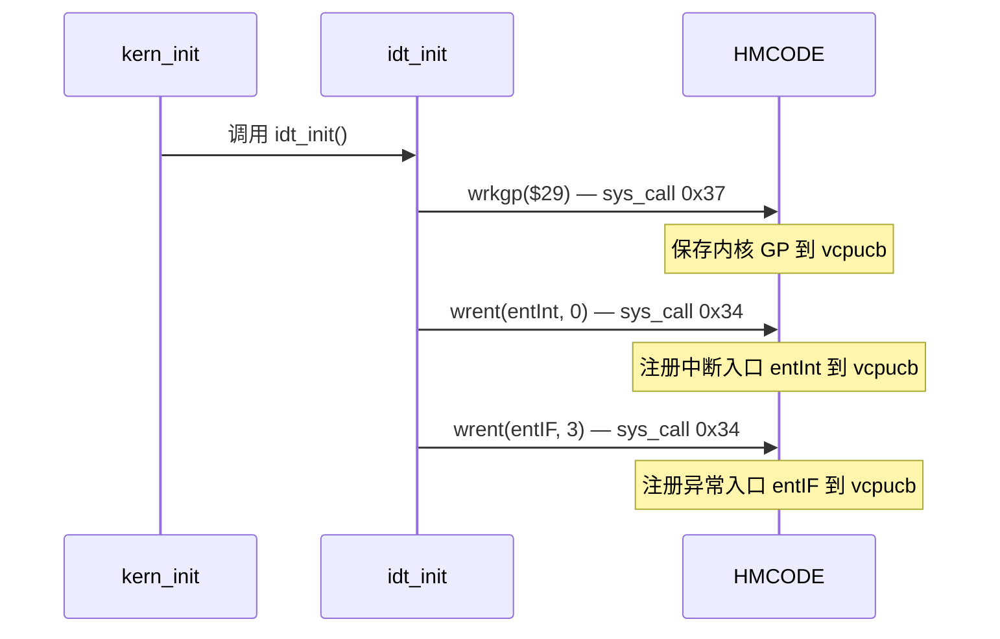
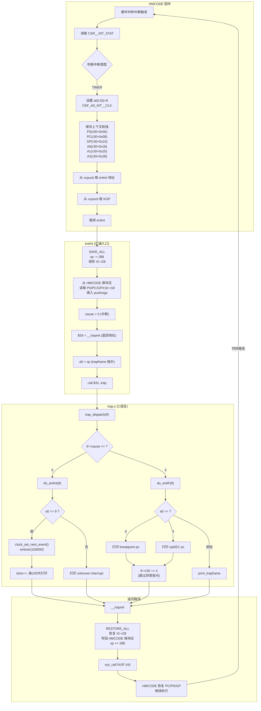
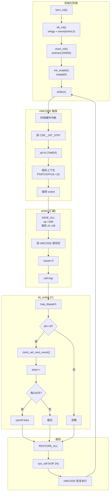
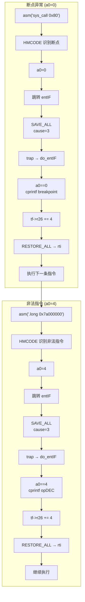

# Lab1.0 中断处理全流程图

## 一、中断注册流程

## 二、中断发生→处理→返回全流程

## 三、时钟中断详细流程

## 四、异常处理流程

## 五、关键寄存器约定

| 寄存器 | 别名 | 用途 |
|--------|------|------|
| $0     | v0   | 返回值 |
| $1~$8  | t0~t7 | 临时寄存器 |
| $9~$15 | s0~s6 | 被调用者保存 |
| $16~$21| a0~a5 | 函数参数 |
| $26    | ra   | 返回地址 |
| $27    | pv   | 过程地址 |
| $29    | gp   | 全局指针 |
| $30    | sp   | 栈指针 |
| $31    | zero | 恒为 0 |

## 六、HMCALL 编号速查

| HMCALL | 编号 | 用途 |
|--------|:---:|------|
| wrent  | 0x34 | 注册入口到 vcpucb |
| swpipl | 0x35 | 中断优先级屏蔽 |
| wrkgp  | 0x37 | 注册内核 GP |
| wrtimer| 0x3B | 设置时钟 |
| rti    | 0x3F | 中断返回 |
